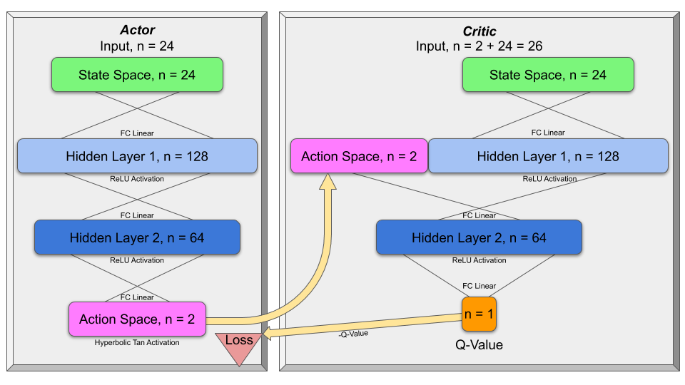
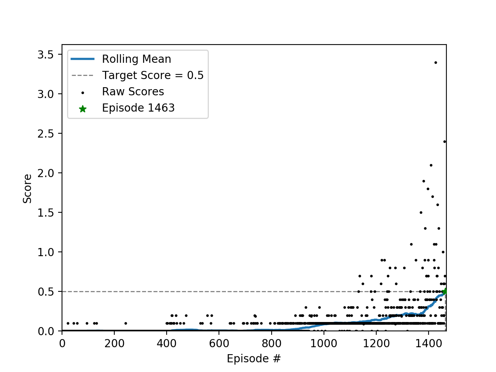

# Project 3: Tennis - Report

## Introduction
This report is written to satisfy the `Report` component of the project 3 rubric and is divided into three sections per 
the [rubric](https://review.udacity.com/#!/rubrics/1891/view).  

A very interesting aspect of this project was the near complete reuse from project 2, which solved the Reacher 
environment.  The exact same agents were used with the exact same hyperparameters.  The only difference was a list of 
two agents, one for each player, and the replay buffer of each agent was populated with the experiences of both players.
The Reacher solution can be found in [this](https://github.com/daniel-fudge/reinforcement-learning-reacher) repo.

## Learning Algorithm  
As defined in the rubric, this section _"clearly describes the learning algorithm, along with the chosen hyperparameters.
It also describes the model architectures for any neural networks"_.

This implementation uses a custom Python package `tennis` contained in this repository.  Within this package exists 3 
submodules `model`, `ddpg_agent` and `train`.

### `model` Submodule
The `model` submodule  defines an `Actor` and `Critic` class that extends the `torch.nn.Module` class.  
Their initialization methods accept the following 3 arguments.  
- `state_size` (int): Dimension of each state.  
- `action_size` (int): Dimension of each action.  
- `seed` (int): Random seed.  

They also use the `FC1_UNITS` and `FC2_UNITS` global variables to define the size of the linear fully connected hidden 
layers as illustrated in the Architecture section below.  

The `Actor` and `Critic` classes also have a `forward` method that accepts the current state and propagates it forward 
through the linear network, while applying the `torch.nn.functional.relu` rectified linear unit to each layer in the 
propagation.  The `Actor` applies the `torch.nn.functional.tanh` function to the output of the final layer to generate 
output between -1 and 1 as required for the action space.  Where as the `Critic` generates a single Q-value for the 
state and action provided by the `Actor`.

### `ddpg_agent` Submodule
The `ddpg_agent` submodule defines 3 classes; `Agent`, `ReplayBuffer` and `OUNoise`.  

The `ReplayBuffer` class stores the experience tuples with its `add` method and allows them to be sampled with its 
`sample` method to perform experience replay learning.  

The `Agent` class creates a local and target `tennis.model.Critic` class; `self.critic_local` and `self.critic_target`. 
As well as a local and target `tennis.model.Actor` class; `self.actor_local` and `self.actor_target`, with the 
`torch.optim.adam` optimizer applied to both local networks.  It also employs experience replay with `self.memory` using 
the `tennis.ddpg_agent.ReplayBuffer`.  

The `OUNoise` class simply defines an Ornstein-Uhlenbeck noise process to be applied to the actions returned from the 
`Agent.act` method to aid learning.

The `Agent.act` method returns action for the given state from the `self.actor_local` network with `OUNoise` added.

The `Agent.learn` method is given a set of experiences, which are a tuple of (s, a, r, s', done) tuples, and a discount 
factor `gamma`.  From these experiences trains both the local Actor and Critic and then performs a soft update from the 
local to target networks for both the Actor and Critic.   
For the Critic it calculates the expected Q-value as `r + gamma * V(s')`, where `V(s')` comes from the 
`self.critic_target` using the actions from the `self.actor_target`.  This expected value is compared with the predicted 
value from `self.critic_local` to determine the loss with the `torch.nn.functional.mse_loss` function.  The loss is then 
passed through a backward propagation and the `torch.optim.Adam` optimizer to train the `self.critic_local` network.   
For the Actor it defines the loss as the negative Q-Value of the local Actor's actions.  Since this negative value is 
minimized in the back propagation and optimization, it maximizes the value of the given actions defined by the local 
Actor.        

### `train` Submodule
The `train` submodule brings the `model` and `ddpg_agent` submodules together to train the agent.  

The `train.setup` function simply initializes the environment and agent.  
The `train.train` function takes the given environment and agent, then trains the agent for the given maximum number of 
episodes or until the running mean error for 100 episode is 0.5 or greater.  Once the training is complete the weights 
are saved as `checkpoint_actor_[player].pth` and `checkpoint_critic_[player.pth]` for player 1 and 2 and the scores are 
saved as a NumPy object as `scores.npz`.

For each time step, the function first determines the action `a` from the `Agent.act` method and the current state `s`.  
Then queries the environment to determine the resulting next state `s'`, reward `r` and if the episode is `done`.  This 
combines to make an experience `(s, a, r, s', done)` tuple.  

The `Agent.step` method then adds the experiences of both players to memory and the `Agent.learn` method is called with 
a random sample of experience tuples from memory to update the Q-Networks as described above.  This is repeated for each
time step until a True `done` value is returned from the environment.  

The `Agent.make_plot` submodule simply reads the `scores.npz` file and generates a plot of the reward evolution.  

### Hyperparameters
The hyperparameters used in the successful training are listed below.
- `batch_size = 256` How many random experiences are passed to `Agent.learn`.
- `buffer_size = 100,000` Number of experiences to save to limit memory usage.
- `gamma = 0.9` The discount factor used in `r + gamma * V(s')` from `Agent.learn`.
- `tau = 0.001` The soft update factor used in `tau*local + (1-tau)*target` from `Agent.learn`.
- `lr_actor = 0.001` The Actor learning rate passed to the `torch.optim.Adam` optimizer.
- `lr_critic = 0.001` The Critic learning rate passed to the `torch.optim.Adam` optimizer.
- `max_t = 1000` The maximum number of time steps per episode.  

### Model Architecture
The image below illustrates the Actor and Critic networks.  As mentioned above the ReLU activation function is used on 
all nodes except the final layer.  The Actor also applies the hyperbolic tangent function to the output to keep the 
actions between -1 and 1.

## Plot of Rewards  
The image below illustrates the score of each episode as well as the running average score for the last 100 episodes.
As you can see, the algorithm solves the problem in 1463 episodes by hitting a running average of +0.5.  Note that
the score is the sum of the rewards the agent receives in an episode without discounting.

## Ideas for Future Work
There is still much to be done for this project.  The most obvious would be to try different architectures, including 
number of nodes per layer, number of layers and the activation functions.  A little script could even be written to 
optimize these features.  
The [paper](https://arxiv.org/abs/1604.06778) by Duan et al. also evaluated eight algorithms for continuous control 
that would be very interesting to investigate.  However the Proximal Policy Optimization (PPO) discussed by 
[OpenAI](https://openai.com/blog/openai-baselines-ppo/) interests me the most due to the promised ease of tuning.  I 
believe this may be extremely important in new applications where hyperparameter tuning may become very costly and error
prone.  
This project was executed on AWS with GPUs and local Windows 10 CPU.  The CPU and GPU speeds were 0.84 and 0.62 seconds 
per episode respectively.  I suspect the modest speed advantage of the GPU was due to the relative small size of the 
network.  Another experiment would be to leverage AWS to perform many parallel episodes and network updates.  This could 
be performed in a synchronous or asynchronous manner.  
